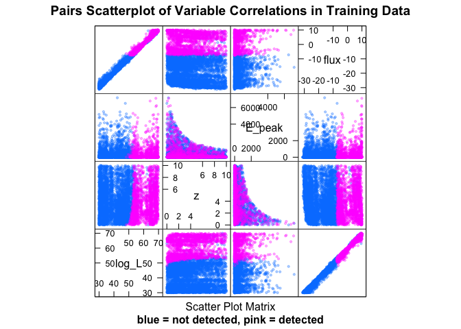
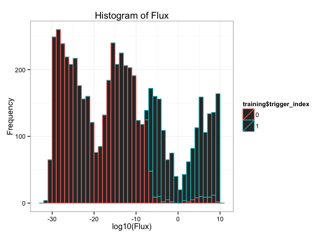
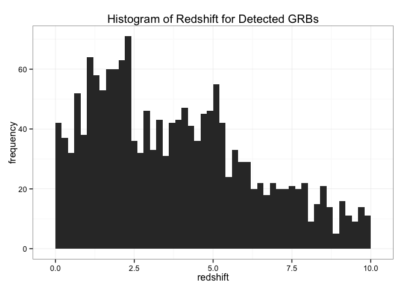
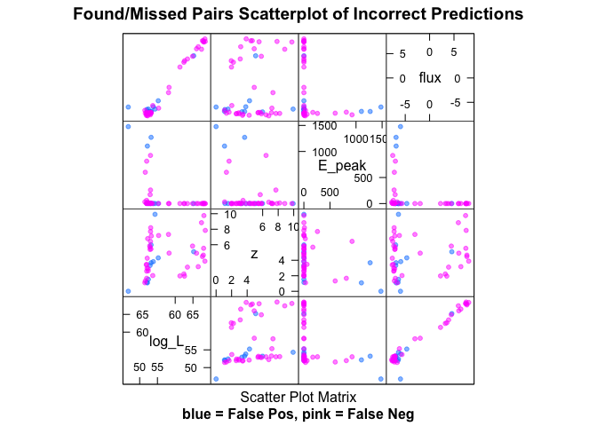

# Swift GRB Pipeline Modeling
Philip Graff  


# Introduction

The Swift satellite's detection pipeline uses over 500 triggering criteria to detect long gamma-ray bursts. Modeling of the GRB and this pipeline is extremely computationally expensive, so here we aim to replace the original model with an approximation trained via machine learning.

# Loading Libraries

```r
library(lattice)
library(ggplot2)
library(caret)
library(rattle)
library(rpart)
library(plyr)
library(randomForest)
library(e1071)
library(klaR)
library(gbm)
library(ada)
library(caTools)
source("ROCfunctions.R")
source("utils.R")
```

# Loading and Preparing the Data
Let's begin our analysis with the newest set of prior samples. The column `trigger_index` indicates if a GRB was detected (1) or not (0). We also add the `(r,phi)` variables from converting the `grid_id` to physical parameters. Lastly, we take the logarithm of certain columns that give intensities.

```r
data <- read.table("data/test_sample_prior2.txt",header=TRUE)
names(data)
```

```
##  [1] "filename"          "log_L"             "z"                
##  [4] "grid_id"           "bin_size_emit"     "alpha"            
##  [7] "beta"              "E_peak"            "background_name"  
## [10] "bgd_15.25keV"      "bgd_15.50keV"      "bgd25.100keV"     
## [13] "bgd50.350keV"      "theta"             "flux"             
## [16] "burst_shape"       "ndet"              "rate_GRB_0_global"
## [19] "z1_global"         "n1_global"         "n2_global"        
## [22] "lum_star_global"   "alpha1_global"     "beta1_global"     
## [25] "Epeak_type"        "Lum_evo_type"      "trigger_index"
```

```r
dim(data)
```

```
## [1] 10000    27
```

```r
data$trigger_index <- as.factor(data$trigger_index)
data[,c("radius","phi")]<-t(sapply(data$grid_id,gridToXY))
logCols <- grep("flux|bgd",names(data))
data[,logCols] <- log10(data[,logCols])
```

## Split into Train/Test and Tidying
We split the data into training/test sets with a 60/40 split. The `filename` column is omitted as this contains no information and the `grid_id` column that is replaced with `radius` and `phi`. We also remove parameters that were saved from the method used to produce the data samples and the names of the backgrounds and burst shapes used for each sample.

```r
set.seed(7632)
split <- createDataPartition(data$trigger_index,p=0.6,list=FALSE)
colRemove <- c(1,grep("global|type|background|burst|grid",names(data)))
training <- data[split,-colRemove]
testing <- data[-split,-colRemove]
```

## Exploratory Plots
Our first plot shows the pair-wise distributions of log-Luminosity (`log_L`), redshift (`z`), peak enrgy (`E_peak`), and log-flux (`flux`) for both triggered and missed GRBs. Triggered ones are in pink and missed ones are in blue.


```r
featurePlot(training[,c("log_L","z","E_peak","flux")],training$trigger_index,plot="pairs",sub="blue = not detected, pink = detected",main="Pairs Scatterplot of Variable Correlations in Training Data",pch=19,cex=0.4,alpha=0.3)
```

 


```r
qplot(training$flux,color=training$trigger_index,binwidth=1,xlab="log10(Flux)",ylab="Frequency",main="Histogram of Flux") + theme_bw()
```

 

We also look at the distribution of redshifts of detected GRBs.


```r
qplot(training$z[training$trigger_index==1],binwidth=0.2,xlab="redshift",ylab="frequency",main="Histogram of Redshift for Detected GRBs") + theme_bw()
```

 

# Machine Learning Analysis
We now train multiple machine learning methods on the problem. Each is then evaluated on the test data for comparison and analyzed using a ROC.

## Random Forests
Random forests uses an ensemble of decision trees. The default of 500 trees per forest is kept.

```r
modRF <- train(trigger_index ~ ., data = training, method = "rf", tuneGrid = expand.grid(mtry = seq(3,13,by=2)), trControl = trainControl(method = "cv", number = 10))
```

This is now evaluated on the test data set.

```r
predRF1 <- predict(modRF$finalModel, testing, type="response")
predRF2 <- predict(modRF$finalModel, testing, type="prob")
confMatRF <- confusionMatrix(predRF1, testing$trigger_index)
confMatRF
```

```
## Confusion Matrix and Statistics
## 
##           Reference
## Prediction    0    1
##          0 2867   14
##          1   18 1100
##                                         
##                Accuracy : 0.992         
##                  95% CI : (0.989, 0.995)
##     No Information Rate : 0.721         
##     P-Value [Acc > NIR] : <2e-16        
##                                         
##                   Kappa : 0.98          
##  Mcnemar's Test P-Value : 0.596         
##                                         
##             Sensitivity : 0.994         
##             Specificity : 0.987         
##          Pos Pred Value : 0.995         
##          Neg Pred Value : 0.984         
##              Prevalence : 0.721         
##          Detection Rate : 0.717         
##    Detection Prevalence : 0.720         
##       Balanced Accuracy : 0.991         
##                                         
##        'Positive' Class : 0             
## 
```

We plot a ROC to see performance varying over threshold value.

```r
rocRF <- calculateROC(testing$trigger_index, predRF2[,2], d = 0.001)
plotROC(rocRF, title = "Random Forests ROC")
```

 

The optimal threshold is at a probability of 0.476 and achieves an accuracy of 99.2248%.

To analyze further, we consider the relative variable importances.

```r
varImp(modRF$finalModel)
```

```
##                Overall
## log_L          427.312
## z                5.538
## bin_size_emit    5.633
## alpha           15.229
## beta             7.548
## E_peak         144.857
## bgd_15.25keV     3.235
## bgd_15.50keV     2.612
## bgd25.100keV     2.846
## bgd50.350keV     2.731
## theta           19.452
## flux          1756.319
## ndet             4.034
## radius          13.058
## phi              4.817
```
We clearly see that the `flux` is most important. `E_peak` and `log_L` take a distant second and third place ranking.

## AdaBoost
AdaBoost performs boosting of decision trees, where an ensemble of trees is used. Each time a tree is trained, samples predicted correctly are down-weighted and samples predicted incorrectly are up-weighted. We tune over the number of trees, the tree depth, and learning rate.

```r
modAda <- train(trigger_index ~ ., data = training, method = "ada", tuneGrid = expand.grid(nu=0.1, iter=seq(50,200,by=50), maxdepth=seq(1,4)), trControl = trainControl(method = "cv"))
```

This is now evaluated on the test data set.

```r
predAda1 <- predict(modAda$finalModel, testing, type="vector")
predAda2 <- predict(modAda$finalModel, testing, type="prob")
confMatAda <- confusionMatrix(predAda1, testing$trigger_index)
confMatAda
```

```
## Confusion Matrix and Statistics
## 
##           Reference
## Prediction    0    1
##          0 2864   11
##          1   21 1103
##                                         
##                Accuracy : 0.992         
##                  95% CI : (0.989, 0.995)
##     No Information Rate : 0.721         
##     P-Value [Acc > NIR] : <2e-16        
##                                         
##                   Kappa : 0.98          
##  Mcnemar's Test P-Value : 0.112         
##                                         
##             Sensitivity : 0.993         
##             Specificity : 0.990         
##          Pos Pred Value : 0.996         
##          Neg Pred Value : 0.981         
##              Prevalence : 0.721         
##          Detection Rate : 0.716         
##    Detection Prevalence : 0.719         
##       Balanced Accuracy : 0.991         
##                                         
##        'Positive' Class : 0             
## 
```

We plot a ROC to see performance varying over threshold value.

```r
rocAda <- calculateROC(testing$trigger_index, predAda2[,2], d = 0.001)
plotROC(rocAda, title = "AdaBoost ROC")
```

 

The optimal threshold is at a probability of 0.483 and achieves an accuracy of 99.1998%.

## Support Vector Machines
Support vector machines...

```r
#modSVM <- train(trigger_index ~ ., data = training, method = "svmRadial", tuneLength = 3, preProc = c("center", "scale"), trControl = trainControl(method = "cv", classProbs = TRUE))
#modSVM
```

This is now evaluated on the test data set.

```r
#predSVM1 <- predict(modSVM$finalModel, testing, type="response")
#predSVM2 <- predict(modSVM$finalModel, testing, type="prob")
#confMatSVM <- confusionMatrix(predSVM1, testing$trigger_index)
#confMatSVM
```

We plot a ROC to see performance varying over threshold value.

```r
#rocSVM <- calculateROC(testing$trigger_index, predSVM2[,2], d = 0.001)
#plotROC(rocSVM, title = "Support Vector Machines ROC")
```

## Linear/Quadratic Discriminant Analysis
Linear and quadratic discriminant analysis form linear or quadratic decision boundaries in the input feature space. These are determined by fitting multivariate Guassians to each class. Linear discriminant analysis requires that they all use the same covariance matrix, while quadratic discriminant analysis allows the covariances to vary.

```r
modLDA <- train(trigger_index ~ ., data = training, method = "lda", preProc = c("center", "scale"), trControl = trainControl(method = "cv"))
modQDA <- train(trigger_index ~ ., data = training, method = "qda", preProc = c("center", "scale"), trControl = trainControl(method = "cv"))
```

This is now evaluated on the test data set.

```r
predLDA <- predict(modLDA, testing)
predQDA <- predict(modQDA, testing)
confMatLDA <- confusionMatrix(predLDA, testing$trigger_index)
confMatLDA
```

```
## Confusion Matrix and Statistics
## 
##           Reference
## Prediction    0    1
##          0 2810   81
##          1   75 1033
##                                         
##                Accuracy : 0.961         
##                  95% CI : (0.955, 0.967)
##     No Information Rate : 0.721         
##     P-Value [Acc > NIR] : <2e-16        
##                                         
##                   Kappa : 0.903         
##  Mcnemar's Test P-Value : 0.689         
##                                         
##             Sensitivity : 0.974         
##             Specificity : 0.927         
##          Pos Pred Value : 0.972         
##          Neg Pred Value : 0.932         
##              Prevalence : 0.721         
##          Detection Rate : 0.703         
##    Detection Prevalence : 0.723         
##       Balanced Accuracy : 0.951         
##                                         
##        'Positive' Class : 0             
## 
```

```r
confMatQDA <- confusionMatrix(predQDA, testing$trigger_index)
confMatQDA
```

```
## Confusion Matrix and Statistics
## 
##           Reference
## Prediction    0    1
##          0 2823  135
##          1   62  979
##                                         
##                Accuracy : 0.951         
##                  95% CI : (0.944, 0.957)
##     No Information Rate : 0.721         
##     P-Value [Acc > NIR] : < 2e-16       
##                                         
##                   Kappa : 0.875         
##  Mcnemar's Test P-Value : 2.9e-07       
##                                         
##             Sensitivity : 0.979         
##             Specificity : 0.879         
##          Pos Pred Value : 0.954         
##          Neg Pred Value : 0.940         
##              Prevalence : 0.721         
##          Detection Rate : 0.706         
##    Detection Prevalence : 0.740         
##       Balanced Accuracy : 0.929         
##                                         
##        'Positive' Class : 0             
## 
```

LDA has a final accuracy of 96.099%. QDA has a final accuracy of 95.0738%.

## Boosted Logistic Regression
Performs boosting combined with logistic regression.

```r
modLogit <- train(trigger_index ~ ., data = training, method = "LogitBoost", preProc = c("center", "scale"), trControl = trainControl(method = "cv"), tuneLength = 5)
```

This is now evaluated on the test data set.

```r
predLogit <- predict(modLogit, testing)
confMatLogit <- confusionMatrix(predLogit, testing$trigger_index)
confMatLogit
```

```
## Confusion Matrix and Statistics
## 
##           Reference
## Prediction    0    1
##          0 2854   22
##          1   31 1092
##                                        
##                Accuracy : 0.987        
##                  95% CI : (0.983, 0.99)
##     No Information Rate : 0.721        
##     P-Value [Acc > NIR] : <2e-16       
##                                        
##                   Kappa : 0.967        
##  Mcnemar's Test P-Value : 0.272        
##                                        
##             Sensitivity : 0.989        
##             Specificity : 0.980        
##          Pos Pred Value : 0.992        
##          Neg Pred Value : 0.972        
##              Prevalence : 0.721        
##          Detection Rate : 0.714        
##    Detection Prevalence : 0.719        
##       Balanced Accuracy : 0.985        
##                                        
##        'Positive' Class : 0            
## 
```

Boosted logistic regression has a final accuracy of 98.6747%.

## Model Stacking
We may be able to improve upon any one model by performing model stacking. Here, we build a data frame with the predictions of the already trained models and then fit a model based on those predicted values.

```r
stackTrain <- data.frame(rf = predict(modRF$finalModel,training,type="prob")[,2],
                         ada = predict(modRF$finalModel,training,type="prob")[,2],
                         lda = as.numeric(predict(modLDA,training)),
                         qda = as.numeric(predict(modQDA,training)),
                         logit = as.numeric(predict(modLogit,training)),
                         trigger_index = training$trigger_index)
stackTest <- data.frame(rf = predict(modRF$finalModel,testing,type="prob")[,2],
                        ada = predict(modRF$finalModel,testing,type="prob")[,2],
                        lda = as.numeric(predict(modLDA,testing)),
                        qda = as.numeric(predict(modQDA,testing)),
                        logit = as.numeric(predict(modLogit,testing)),
                        trigger_index = testing$trigger_index)
```

Now we fit a model.

```r
modStackTree <- train(trigger_index ~ ., data = stackTrain, method = "rf")
```


```r
predStackTree <- predict(modStackTree$finalModel,stackTest)
confMatStackTree <- confusionMatrix(predStackTree,stackTest$trigger_index)
confMatStackTree
```

```
## Confusion Matrix and Statistics
## 
##           Reference
## Prediction    0    1
##          0 2867   14
##          1   18 1100
##                                         
##                Accuracy : 0.992         
##                  95% CI : (0.989, 0.995)
##     No Information Rate : 0.721         
##     P-Value [Acc > NIR] : <2e-16        
##                                         
##                   Kappa : 0.98          
##  Mcnemar's Test P-Value : 0.596         
##                                         
##             Sensitivity : 0.994         
##             Specificity : 0.987         
##          Pos Pred Value : 0.995         
##          Neg Pred Value : 0.984         
##              Prevalence : 0.721         
##          Detection Rate : 0.717         
##    Detection Prevalence : 0.720         
##       Balanced Accuracy : 0.991         
##                                         
##        'Positive' Class : 0             
## 
```

Our stacked model has an accuracy of 99.1998%. This is no better than our best models, so we take it that the stacking is currently unable to improve upon the performance.

## SkyNet
We perform training with *SkyNet* seperately as this is done outside of R. However, we can print the 10-fold cross-validation training files for use by SkyNet and then load in and analyze the resulting predictions. These files will need some reformatting before using with SkyNet. The train/test sets will be used for training and the blind sets will be used for CV comparison between NN architectures. The eval set is used for evaluating the final chosen model as done for all others already analyzed here.

```r
set.seed(29035)
newTrain <- cbind(training[,-14],trigger_index=as.integer(training$trigger_index)-1)
newTest <- cbind(testing[,-14],trigger_index=as.integer(testing$trigger_index)-1)
nnFolds <- createFolds(training$trigger_index,k=10,returnTrain=TRUE)
for (i in seq(0,9)) {
        inTrain <- createDataPartition(newTrain[nnFolds[[i+1]],]$trigger_index,p=0.75,list=FALSE)
        write.table(x=newTrain[nnFolds[[i+1]][inTrain],],file=paste0("data/SNformat/priorsample2_CV",as.character(i),"_train.txt"),sep=",",row.names=FALSE,col.names=FALSE)
        write.table(x=newTrain[nnFolds[[i+1]][-inTrain],],file=paste0("data/SNformat/priorsample2_CV",as.character(i),"_test.txt"),sep=",",row.names=FALSE,col.names=FALSE)
        write.table(x=newTrain[-nnFolds[[i+1]],],file=paste0("data/SNformat/priorsample2_CV",as.character(i),"_blind.txt"),sep=",",row.names=FALSE,col.names=FALSE)
}
write.table(x=newTest,file="data/SNformat/priorsample2_eval.txt")
```


```r
# Nothing here yet.
```

# Analysis of Predictions
We now take the random forests model, as it - along with AdaBoost - performed the best on the test data, and analyze the distributions of those that were predicted incorrectly.


```r
featurePlot(testing[testing$trigger_index!=predRF1,c("log_L","z","E_peak","flux")],testing$trigger_index[testing$trigger_index!=predRF1],plot="pairs",sub="blue = False Pos, pink = False Neg",main="Found/Missed Pairs Scatterplot of Incorrect Predictions",pch=19,cex=0.6,alpha=0.5)
```

 

# Predicting on Independent Samples from Specific Distributions


# Conclusions


