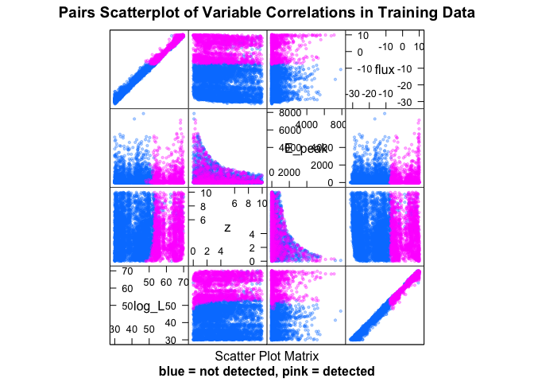

# Swift GRB Pipeline Modeling
Philip Graff  


# Introduction

The Swift satellite's detection pipeline uses over 500 triggering criteria to detect long gamma-ray bursts. Modeling of the GRB and this pipeline is extremely computationally expensive, so here we aim to replace the original model with an approximation trained via machine learning.

# Loading Libraries

```r
library(lattice)
library(ggplot2)
library(caret)
library(rattle)
library(rpart)
library(plyr)
library(randomForest)
library(e1071)
library(klaR)
library(gbm)
library(ada)
library(caTools)
library(kernlab)
source("ROCfunctions.R")
source("utils.R")
```

# Loading and Preparing the Data
Let's begin our analysis with the newest set of prior samples. The column `trigger_index` indicates if a GRB was detected (1) or not (0). We also add the `(r,phi)` variables from converting the `grid_id` to physical parameters. We take the logarithm of certain columns that give intensities. Lastly, we randomly permute the data sample.

```r
data <- read.table("data/test_sample_prior2.txt",header=TRUE)
names(data)
```

```
##  [1] "filename"          "log_L"             "z"                
##  [4] "grid_id"           "bin_size_emit"     "alpha"            
##  [7] "beta"              "E_peak"            "background_name"  
## [10] "bgd_15.25keV"      "bgd_15.50keV"      "bgd25.100keV"     
## [13] "bgd50.350keV"      "theta"             "flux"             
## [16] "burst_shape"       "ndet"              "rate_GRB_0_global"
## [19] "z1_global"         "n1_global"         "n2_global"        
## [22] "lum_star_global"   "alpha1_global"     "beta1_global"     
## [25] "Epeak_type"        "Lum_evo_type"      "trigger_index"
```

```r
dim(data)
```

```
## [1] 10000    27
```

```r
data$trigger_index <- as.factor(data$trigger_index)
data[,c("radius","phi")]<-t(sapply(data$grid_id,gridToXY))
logCols <- grep("flux|bgd",names(data))
data[,logCols] <- log10(data[,logCols])
ranPerm <- sample(seq(1,length(data$trigger_index)),size=length(data$trigger_index))
data <- data[ranPerm,]
```

## Split into Train/Test and Tidying
We split the data into training/test sets with a 60/40 split. The `filename` column is omitted as this contains no information and the `grid_id` column that is replaced with `radius` and `phi`. We also remove parameters that were saved from the method used to produce the data samples and the names of the backgrounds and burst shapes used for each sample.

```r
set.seed(7632)
split <- createDataPartition(data$trigger_index,p=0.6,list=FALSE)
colRemove <- c(1,grep("global|type|background|burst|grid",names(data)))
training <- data[split,-colRemove]
testing <- data[-split,-colRemove]
```

## Exploratory Plots
Our first plot shows the pair-wise distributions of log-Luminosity (`log_L`), redshift (`z`), peak enrgy (`E_peak`), and log-flux (`flux`) for both triggered and missed GRBs. Triggered ones are in pink and missed ones are in blue.


```r
featurePlot(training[,c("log_L","z","E_peak","flux")],training$trigger_index,plot="pairs",sub="blue = not detected, pink = detected",main="Pairs Scatterplot of Variable Correlations in Training Data",pch=19,cex=0.4,alpha=0.3)
```

 


```r
qplot(training$flux,color=training$trigger_index,binwidth=1,xlab="log10(Flux)",ylab="Frequency",main="Histogram of Flux") + theme_bw()
```

 

We also look at the distribution of redshifts of detected GRBs.


```r
qplot(training$z[training$trigger_index==1],binwidth=0.2,xlab="redshift",ylab="frequency",main="Histogram of Redshift for Detected GRBs") + theme_bw()
```

 

# Machine Learning Analysis
We now train multiple machine learning methods on the problem. Each is then evaluated on the test data for comparison and analyzed using a ROC.

## Random Forests
Random forests uses an ensemble of decision trees. The default of 500 trees per forest is kept.

```r
modRF <- train(trigger_index ~ ., data = training, method = "rf", tuneGrid = expand.grid(mtry = seq(3,13,by=2)), trControl = trainControl(method = "cv", number = 10))
```

This is now evaluated on the test data set.

```r
predRF1 <- predict(modRF$finalModel, testing, type="response")
predRF2 <- predict(modRF$finalModel, testing, type="prob")
confMatRF <- confusionMatrix(predRF1, testing$trigger_index)
confMatRF
```

```
## Confusion Matrix and Statistics
## 
##           Reference
## Prediction    0    1
##          0 2874   37
##          1   11 1077
##                                         
##                Accuracy : 0.988         
##                  95% CI : (0.984, 0.991)
##     No Information Rate : 0.721         
##     P-Value [Acc > NIR] : < 2e-16       
##                                         
##                   Kappa : 0.97          
##  Mcnemar's Test P-Value : 0.000308      
##                                         
##             Sensitivity : 0.996         
##             Specificity : 0.967         
##          Pos Pred Value : 0.987         
##          Neg Pred Value : 0.990         
##              Prevalence : 0.721         
##          Detection Rate : 0.719         
##    Detection Prevalence : 0.728         
##       Balanced Accuracy : 0.981         
##                                         
##        'Positive' Class : 0             
## 
```

From the random forests predictions, we can look at this distribution of predicted probabilities.

```r
qplot(predRF2[testing$trigger_index==0,2],binwidth=0.01,xlab="Predicted Probability",main="Distribution of Predictions for Non-Detections") + theme_bw()
```

 

```r
qplot(predRF2[testing$trigger_index==1,2],binwidth=0.01,xlab="Predicted Probability",main="Distribution of Predictions for Detections") + theme_bw()
```

 

We plot a ROC to see performance varying over threshold value.

```r
rocRF <- calculateROC(testing$trigger_index, predRF2[,2], d = 0.001)
plotROC(rocRF, title = "Random Forests ROC")
```

 

The optimal threshold is at a probability of 0.421 and achieves an accuracy of 98.9997%.

To analyze further, we consider the relative variable importances.

```r
varImp(modRF$finalModel)
```

```
##                Overall
## log_L          455.329
## z                6.158
## bin_size_emit    6.555
## alpha            7.359
## beta            11.002
## E_peak         154.730
## bgd_15.25keV     2.434
## bgd_15.50keV     2.226
## bgd25.100keV     2.382
## bgd50.350keV     2.691
## theta           18.025
## flux          1727.221
## ndet             6.028
## radius          11.505
## phi              1.625
```
We clearly see that the `flux` is most important. `E_peak` and `log_L` take a distant second and third place ranking.

## AdaBoost
AdaBoost performs boosting of decision trees, where an ensemble of trees is used. Each time a tree is trained, samples predicted correctly are down-weighted and samples predicted incorrectly are up-weighted. We tune over the number of trees, the tree depth, and learning rate.

```r
modAda <- train(trigger_index ~ ., data = training, method = "ada", tuneGrid = expand.grid(nu=0.1, iter=seq(50,150,by=50), maxdepth=seq(2,4)), trControl = trainControl(method = "cv"))
```

This is now evaluated on the test data set.

```r
predAda1 <- predict(modAda$finalModel, testing, type="vector")
predAda2 <- predict(modAda$finalModel, testing, type="prob")
confMatAda <- confusionMatrix(predAda1, testing$trigger_index)
confMatAda
```

```
## Confusion Matrix and Statistics
## 
##           Reference
## Prediction    0    1
##          0 2872   27
##          1   13 1087
##                                         
##                Accuracy : 0.99          
##                  95% CI : (0.986, 0.993)
##     No Information Rate : 0.721         
##     P-Value [Acc > NIR] : <2e-16        
##                                         
##                   Kappa : 0.975         
##  Mcnemar's Test P-Value : 0.0398        
##                                         
##             Sensitivity : 0.995         
##             Specificity : 0.976         
##          Pos Pred Value : 0.991         
##          Neg Pred Value : 0.988         
##              Prevalence : 0.721         
##          Detection Rate : 0.718         
##    Detection Prevalence : 0.725         
##       Balanced Accuracy : 0.986         
##                                         
##        'Positive' Class : 0             
## 
```

We plot a ROC to see performance varying over threshold value.

```r
rocAda <- calculateROC(testing$trigger_index, predAda2[,2], d = 0.001)
plotROC(rocAda, title = "AdaBoost ROC")
```

 

The optimal threshold is at a probability of 0.508 and achieves an accuracy of 99.0248%.

## Support Vector Machines
Support vector machines...

```r
modSVM <- train(trigger_index ~ ., data = training, method = "svmRadial", tuneGrid = expand.grid(C = c(0.05,0.1,0.2,0.5), sigma = c(0.0005,0.001,0.002,0.005,0.01,0.02)), preProc = c("center", "scale"), trControl = trainControl(method = "cv", classProbs = TRUE))
modSVM
```

```
## Support Vector Machines with Radial Basis Function Kernel 
## 
## 6001 samples
##   15 predictor
##    2 classes: '0', '1' 
## 
## Pre-processing: centered, scaled 
## Resampling: Cross-Validated (10 fold) 
## 
## Summary of sample sizes: 5400, 5402, 5401, 5400, 5401, 5401, ... 
## 
## Resampling results across tuning parameters:
## 
##   C     sigma  Accuracy  Kappa  Accuracy SD  Kappa SD
##   0.05  5e-04  0.9       0.8    0.011        0.02    
##   0.05  1e-03  0.9       0.8    0.011        0.02    
##   0.05  2e-03  0.9       0.8    0.010        0.02    
##   0.05  5e-03  1.0       0.9    0.008        0.02    
##   0.05  1e-02  1.0       0.9    0.010        0.02    
##   0.05  2e-02  1.0       0.9    0.010        0.02    
##   0.10  5e-04  0.9       0.8    0.011        0.02    
##   0.10  1e-03  0.9       0.8    0.010        0.02    
##   0.10  2e-03  1.0       0.9    0.006        0.01    
##   0.10  5e-03  1.0       0.9    0.009        0.02    
##   0.10  1e-02  1.0       0.9    0.009        0.02    
##   0.10  2e-02  1.0       0.9    0.008        0.02    
##   0.20  5e-04  0.9       0.8    0.011        0.02    
##   0.20  1e-03  1.0       0.9    0.007        0.02    
##   0.20  2e-03  1.0       0.9    0.009        0.02    
##   0.20  5e-03  1.0       0.9    0.008        0.02    
##   0.20  1e-02  1.0       0.9    0.008        0.02    
##   0.20  2e-02  1.0       0.9    0.007        0.02    
##   0.50  5e-04  1.0       0.9    0.010        0.03    
##   0.50  1e-03  1.0       0.9    0.009        0.02    
##   0.50  2e-03  1.0       0.9    0.009        0.02    
##   0.50  5e-03  1.0       0.9    0.008        0.02    
##   0.50  1e-02  1.0       0.9    0.006        0.01    
##   0.50  2e-02  1.0       0.9    0.007        0.02    
## 
## Accuracy was used to select the optimal model using  the largest value.
## The final values used for the model were sigma = 0.002 and C = 0.1.
```

This is now evaluated on the test data set.

```r
predSVM <- predict(modSVM, testing, type="raw")
confMatSVM <- confusionMatrix(predSVM, testing$trigger_index)
confMatSVM
```

```
## Confusion Matrix and Statistics
## 
##           Reference
## Prediction    0    1
##          0 2802   77
##          1   83 1037
##                                         
##                Accuracy : 0.96          
##                  95% CI : (0.953, 0.966)
##     No Information Rate : 0.721         
##     P-Value [Acc > NIR] : <2e-16        
##                                         
##                   Kappa : 0.901         
##  Mcnemar's Test P-Value : 0.693         
##                                         
##             Sensitivity : 0.971         
##             Specificity : 0.931         
##          Pos Pred Value : 0.973         
##          Neg Pred Value : 0.926         
##              Prevalence : 0.721         
##          Detection Rate : 0.701         
##    Detection Prevalence : 0.720         
##       Balanced Accuracy : 0.951         
##                                         
##        'Positive' Class : 0             
## 
```

The support vector machines method has a final accuracy of 95.999%.

## Linear/Quadratic Discriminant Analysis
Linear and quadratic discriminant analysis form linear or quadratic decision boundaries in the input feature space. These are determined by fitting multivariate Guassians to each class. Linear discriminant analysis requires that they all use the same covariance matrix, while quadratic discriminant analysis allows the covariances to vary.

```r
modLDA <- train(trigger_index ~ ., data = training, method = "lda", preProc = c("center", "scale"), trControl = trainControl(method = "cv"))
modQDA <- train(trigger_index ~ ., data = training, method = "qda", preProc = c("center", "scale"), trControl = trainControl(method = "cv"))
```

This is now evaluated on the test data set.

```r
predLDA <- predict(modLDA, testing)
predQDA <- predict(modQDA, testing)
confMatLDA <- confusionMatrix(predLDA, testing$trigger_index)
confMatLDA
```

```
## Confusion Matrix and Statistics
## 
##           Reference
## Prediction    0    1
##          0 2823  103
##          1   62 1011
##                                         
##                Accuracy : 0.959         
##                  95% CI : (0.952, 0.965)
##     No Information Rate : 0.721         
##     P-Value [Acc > NIR] : < 2e-16       
##                                         
##                   Kappa : 0.896         
##  Mcnemar's Test P-Value : 0.00185       
##                                         
##             Sensitivity : 0.979         
##             Specificity : 0.908         
##          Pos Pred Value : 0.965         
##          Neg Pred Value : 0.942         
##              Prevalence : 0.721         
##          Detection Rate : 0.706         
##    Detection Prevalence : 0.732         
##       Balanced Accuracy : 0.943         
##                                         
##        'Positive' Class : 0             
## 
```

```r
confMatQDA <- confusionMatrix(predQDA, testing$trigger_index)
confMatQDA
```

```
## Confusion Matrix and Statistics
## 
##           Reference
## Prediction    0    1
##          0 2809  155
##          1   76  959
##                                         
##                Accuracy : 0.942         
##                  95% CI : (0.935, 0.949)
##     No Information Rate : 0.721         
##     P-Value [Acc > NIR] : < 2e-16       
##                                         
##                   Kappa : 0.853         
##  Mcnemar's Test P-Value : 2.87e-07      
##                                         
##             Sensitivity : 0.974         
##             Specificity : 0.861         
##          Pos Pred Value : 0.948         
##          Neg Pred Value : 0.927         
##              Prevalence : 0.721         
##          Detection Rate : 0.702         
##    Detection Prevalence : 0.741         
##       Balanced Accuracy : 0.917         
##                                         
##        'Positive' Class : 0             
## 
```

LDA has a final accuracy of 95.874%. QDA has a final accuracy of 94.2236%.

## Boosted Logistic Regression
Performs boosting combined with logistic regression.

```r
modLogit <- train(trigger_index ~ ., data = training, method = "LogitBoost", preProc = c("center", "scale"), trControl = trainControl(method = "cv"), tuneLength = 5)
```

This is now evaluated on the test data set.

```r
predLogit <- predict(modLogit, testing)
confMatLogit <- confusionMatrix(predLogit, testing$trigger_index)
confMatLogit
```

```
## Confusion Matrix and Statistics
## 
##           Reference
## Prediction    0    1
##          0 2863   37
##          1   22 1077
##                                         
##                Accuracy : 0.985         
##                  95% CI : (0.981, 0.989)
##     No Information Rate : 0.721         
##     P-Value [Acc > NIR] : <2e-16        
##                                         
##                   Kappa : 0.963         
##  Mcnemar's Test P-Value : 0.0684        
##                                         
##             Sensitivity : 0.992         
##             Specificity : 0.967         
##          Pos Pred Value : 0.987         
##          Neg Pred Value : 0.980         
##              Prevalence : 0.721         
##          Detection Rate : 0.716         
##    Detection Prevalence : 0.725         
##       Balanced Accuracy : 0.980         
##                                         
##        'Positive' Class : 0             
## 
```

Boosted logistic regression has a final accuracy of 98.5246%.

## Naive Bayes
The Naive Bayes method assumes that all parameters are independent.

```r
modNB <- train(trigger_index ~ ., data = training, method = "nb", preProc = c("center", "scale"), trControl = trainControl(method = "cv"), tuneLength = 5)
```

This is now evaluated on the test data set.

```r
predNB <- predict(modNB, testing)
confMatNB <- confusionMatrix(predNB, testing$trigger_index)
confMatNB
```

```
## Confusion Matrix and Statistics
## 
##           Reference
## Prediction    0    1
##          0 2796   67
##          1   89 1047
##                                         
##                Accuracy : 0.961         
##                  95% CI : (0.955, 0.967)
##     No Information Rate : 0.721         
##     P-Value [Acc > NIR] : <2e-16        
##                                         
##                   Kappa : 0.904         
##  Mcnemar's Test P-Value : 0.0927        
##                                         
##             Sensitivity : 0.969         
##             Specificity : 0.940         
##          Pos Pred Value : 0.977         
##          Neg Pred Value : 0.922         
##              Prevalence : 0.721         
##          Detection Rate : 0.699         
##    Detection Prevalence : 0.716         
##       Balanced Accuracy : 0.955         
##                                         
##        'Positive' Class : 0             
## 
```

Naive Bayes has a final accuracy of 96.099%.

## Model Stacking
We may be able to improve upon any one model by performing model stacking. Here, we build a data frame with the predictions of the already trained models and then fit a model based on those predicted values.

```r
stackTrain <- data.frame(rf = predict(modRF$finalModel,training,type="prob")[,2],
                         ada = predict(modRF$finalModel,training,type="prob")[,2],
                         svm = as.numeric(predict(modSVM,training)),
                         lda = as.numeric(predict(modLDA,training)),
                         qda = as.numeric(predict(modQDA,training)),
                         logit = as.numeric(predict(modLogit,training)),
                         nb = as.numeric(predict(modNB,training)),
                         trigger_index = training$trigger_index)
stackTest <- data.frame(rf = predict(modRF$finalModel,testing,type="prob")[,2],
                        ada = predict(modRF$finalModel,testing,type="prob")[,2],
                        svm = as.numeric(predict(modSVM,testing)),
                        lda = as.numeric(predict(modLDA,testing)),
                        qda = as.numeric(predict(modQDA,testing)),
                        logit = as.numeric(predict(modLogit,testing)),
                        nb = as.numeric(predict(modNB,testing)),
                        trigger_index = testing$trigger_index)
```

Now we fit a model.

```r
modStackTree <- train(trigger_index ~ ., data = stackTrain, method = "rf")
```


```r
predStackTree <- predict(modStackTree$finalModel,stackTest)
confMatStackTree <- confusionMatrix(predStackTree,stackTest$trigger_index)
confMatStackTree
```

```
## Confusion Matrix and Statistics
## 
##           Reference
## Prediction    0    1
##          0 2875   40
##          1   10 1074
##                                         
##                Accuracy : 0.987         
##                  95% CI : (0.984, 0.991)
##     No Information Rate : 0.721         
##     P-Value [Acc > NIR] : < 2e-16       
##                                         
##                   Kappa : 0.969         
##  Mcnemar's Test P-Value : 4.11e-05      
##                                         
##             Sensitivity : 0.997         
##             Specificity : 0.964         
##          Pos Pred Value : 0.986         
##          Neg Pred Value : 0.991         
##              Prevalence : 0.721         
##          Detection Rate : 0.719         
##    Detection Prevalence : 0.729         
##       Balanced Accuracy : 0.980         
##                                         
##        'Positive' Class : 0             
## 
```

Our stacked model has an accuracy of 98.7497%. This is no better than our best models, so we take it that the stacking is currently unable to improve upon the performance.

## SkyNet
We perform training with *SkyNet* seperately as this is done outside of R. However, we can print the 10-fold cross-validation training files for use by SkyNet and then load in and analyze the resulting predictions. These files will need some reformatting before using with SkyNet. The train/test sets will be used for training and the blind sets will be used for CV comparison between NN architectures. The eval set is used for evaluating the final chosen model as done for all others already analyzed here.

```r
set.seed(29035)
newTrain <- cbind(training[,-14],trigger_index=as.integer(training$trigger_index)-1)
newTest <- cbind(testing[,-14],trigger_index=as.integer(testing$trigger_index)-1)
nnFolds <- createFolds(training$trigger_index,k=10,returnTrain=TRUE)
for (i in seq(0,9)) {
        inTrain <- createDataPartition(newTrain[nnFolds[[i+1]],]$trigger_index,p=0.75,list=FALSE)
        write.table(x=newTrain[nnFolds[[i+1]][inTrain],],file=paste0("data/SNformat/priorsample2_CV",as.character(i),"_train.txt"),sep=",",row.names=FALSE,col.names=FALSE)
        write.table(x=newTrain[nnFolds[[i+1]][-inTrain],],file=paste0("data/SNformat/priorsample2_CV",as.character(i),"_test.txt"),sep=",",row.names=FALSE,col.names=FALSE)
        write.table(x=newTrain[-nnFolds[[i+1]],],file=paste0("data/SNformat/priorsample2_CV",as.character(i),"_blind.txt"),sep=",",row.names=FALSE,col.names=FALSE)
}
write.table(x=newTest,file="data/SNformat/priorsample2_eval.txt",sep=",",row.names=FALSE,col.names=FALSE)
```

The predictions are then read in - averaging over all cross-validation networks - and the accuracy is computed.

```r
nets <- list(c("25","10"),c("25","30"),c("50","10"),c("50","30"),c("100","10"),c("100","30"),c("25-25","110"),c("25-25","330"),c("50-50","110"),c("50-50","330"),c("100-30","110"),c("100-30","330"),c("100-50","110"),c("100-50","330"),c("100-100","110"),c("100-100","330"))
results <- c()
for (i in seq(1,length(nets))) {
        nnpred <- read.table(paste0("NNpreds/priorsample2_CVall_nhid-",nets[[i]][1],"_act",nets[[i]][2],"_blind_pred.txt"))
        acc <- sum((nnpred[,17]==0 & nnpred[,19]<0.5) | (nnpred[,17]==1 & nnpred[,19]>=0.5))/length(nnpred[,17])
        for (j in seq(0,9)) {
                nnpred <- read.table(paste0("NNpreds/priorsample2_CV",as.character(j),"_nhid-",nets[[i]][1],"_act",nets[[i]][2],"_eval_pred.txt"))
                if (j==0) {
                        truevals <- nnpred[,17]
                        predvals <- nnpred[,19]/10
                } else {
                        predvals <- predvals + nnpred[,19]/10
                }
        }
        eval <- sum((truevals==0 & predvals<0.5) | (truevals==1 & predvals>=0.5))/length(truevals)
        results <- rbind(results,cbind(nets[[i]][1],nets[[i]][2],acc,eval))
}
colnames(results) <- c("Layers","Activation","Test.Accuracy","Evaluation.Accuracy")
results <- data.frame(results)
results
```

```
##     Layers Activation     Test.Accuracy Evaluation.Accuracy
## 1       25         10 0.975170804865856    0.97249312328082
## 2       25         30 0.977337110481586   0.971242810702676
## 3       50         10 0.978003666055657   0.972993248312078
## 4       50         30 0.973671054824196   0.971742935733933
## 5      100         10 0.977337110481586   0.972243060765191
## 6      100         30 0.974004332611231    0.97249312328082
## 7    25-25        110 0.975337443759373   0.975493873468367
## 8    25-25        330 0.975337443759373   0.972993248312078
## 9    50-50        110  0.97633727712048   0.975243810952738
## 10   50-50        330 0.975170804865856   0.972993248312078
## 11  100-30        110  0.97633727712048   0.975493873468367
## 12  100-30        330 0.973837693717714   0.972243060765191
## 13  100-50        110 0.976503916013998   0.975493873468367
## 14  100-50        330  0.97483752707882   0.971992998249562
## 15 100-100        110 0.977503749375104   0.975493873468367
## 16 100-100        330 0.975170804865856   0.972743185796449
```

From the SkyNet predictions, we can look at the distribution of predicted probabilities from the network that performed best on the test data - a single hidden layer with 50 nodes and sigmoid activation function.

```r
nnpred <- read.table(paste0("NNpreds/priorsample2_CVall_nhid-",nets[[3]][1],"_act",nets[[3]][2],"_blind_pred.txt"))
acc <- sum((nnpred[,17]==0 & nnpred[,19]<0.5) | (nnpred[,17]==1 & nnpred[,19]>=0.5))/length(nnpred[,17])
for (j in seq(0,9)) {
        nnpred <- read.table(paste0("NNpreds/priorsample2_CV",as.character(j),"_nhid-",nets[[3]][1],"_act",nets[[3]][2],"_eval_pred.txt"))
        if (j==0) {
                truevals <- nnpred[,17]
                predvals <- nnpred[,19]/10
        } else {
                predvals <- predvals + nnpred[,19]/10
        }
}
qplot(predvals[truevals==0],binwidth=0.01,xlab="Predicted Probability",main="Distribution of Predictions for Non-Detections") + theme_bw()
```

 

```r
qplot(predvals[truevals==1],binwidth=0.01,xlab="Predicted Probability",main="Distribution of Predictions for Detections") + theme_bw()
```

 

We plot a ROC to see performance varying over threshold value.

```r
rocSkyNet <- calculateROC(truevals, predvals, d = 0.001)
plotROC(rocSkyNet, title = "SkyNet ROC")
```

 

The optimal threshold is at a probability of 0.257 and achieves an accuracy of 97.4494%.

# Analysis of Predictions
We now take the random forests model, as it - along with AdaBoost - performed the best on the test data, and analyze the distributions of those that were predicted incorrectly.


```r
featurePlot(testing[testing$trigger_index!=predRF1,c("log_L","z","E_peak","flux")],testing$trigger_index[testing$trigger_index!=predRF1],plot="pairs",sub="blue = False Pos, pink = False Neg",main="Found/Missed Pairs Scatterplot of Incorrect Predictions",pch=19,cex=0.6,alpha=0.5)
```

 

# Predicting on Independent Samples from Specific Distributions
In a first test of the predictors, we load in some data from a specific source GRB distribution. Five sets with different seeds and different numbers of active detectors are used. The combined data is also written for SkyNet use.

```r
files <- c("summary_list_Swiftlc_z360_lum5205_n0084_n1207_n2070_alpha065_beta300_Yonetoku_mod18_noevo_ndet27147.txt","summary_list_Swiftlc_z360_lum5205_n0084_n1207_n2070_alpha065_beta300_Yonetoku_mod18_seed11_noevo_ndet26997.txt","summary_list_Swiftlc_z360_lum5205_n0084_n1207_n2070_alpha065_beta300_Yonetoku_mod18_seed12_noevo_ndet29413.txt","summary_list_Swiftlc_z360_lum5205_n0084_n1207_n2070_alpha065_beta300_Yonetoku_mod18_seed50_noevo_ndet24387.txt","summary_list_Swiftlc_z360_lum5205_n0084_n1207_n2070_alpha065_beta300_Yonetoku_mod18_seed60_noevo_ndet26478.txt")
realdata <- c()
for (i in seq(1,5)) {
        temp <- read.table(paste0("data/",files[i]),header=TRUE)
        temp$trigger_index <- as.factor(temp$trigger_index)
        temp[,c("radius","phi")]<-t(sapply(temp$grid_id,gridToXY))
        logCols <- grep("flux|bgd",names(temp))
        temp[,logCols] <- log10(temp[,logCols])
        colRemove <- c(1,grep("global|type|background|burst|grid",names(temp)))
        temp <- temp[,-colRemove]
        realdata <- rbind(realdata,temp)
}
SNrealdata <- cbind(realdata[,-14],trigger_index=as.integer(realdata$trigger_index)-1)
write.table(x=SNrealdata,file="data/SNformat/summary_list_Swiftlc_z360_lum5205_n0084_n1207_n2070_alpha065_beta300_Yonetoku_mod18_noevo_all.txt",sep=",",row.names=FALSE,col.names=FALSE)
```

We now evaluate our trained predictors on this data set and consider their accuracy.

```r
realTestRF <- confusionMatrix(predict(modRF$finalModel,realdata),realdata$trigger_index)
realTestAda <- confusionMatrix(predict(modAda$finalModel,realdata),realdata$trigger_index)
realTestSVM <- confusionMatrix(predict(modSVM,realdata),realdata$trigger_index)
realTestLDA <- confusionMatrix(predict(modLDA,realdata),realdata$trigger_index)
realTestQDA <- confusionMatrix(predict(modQDA,realdata),realdata$trigger_index)
realTestLogit <- confusionMatrix(predict(modLogit,realdata),realdata$trigger_index)
realTestNB <- confusionMatrix(predict(modNB,realdata),realdata$trigger_index)
```

Here we summarize the accuracies:

 - Random forests:  93.5226%
 
 - AdaBoost:  94.7985%
 
 - Support vector machines:  86.8373%
 
 - Linear disc. analysis:  86.9573%
 
 - Quadratic disc. analysis:  86.0514%
 
 - Boosted logistic regression:  91.6048%
 
 - Naive Bayes:  86.8653%

And lastly we load in the SkyNet predictions and evaluate them.

```r
realResults <- c()
for (i in seq(1,length(nets))) {
        for (j in seq(0,9)) {
                nnpred <- read.table(paste0("NNpreds/priorsample2_CV",as.character(j),"_nhid-",nets[[i]][1],"_act",nets[[i]][2],"_realdata_pred.txt"))
                if (j==0) {
                        truevals <- nnpred[,17]
                        predvals <- nnpred[,19]/10
                } else {
                        predvals <- predvals + nnpred[,19]/10
                }
        }
        eval <- sum((truevals==0 & predvals<0.5) | (truevals==1 & predvals>=0.5))/length(truevals)
        realResults <- rbind(realResults,cbind(nets[[i]][1],nets[[i]][2],eval))
}
colnames(realResults) <- c("Layers","Activation","Accuracy")
realResults <- data.frame(realResults)
realResults
```

```
##     Layers Activation          Accuracy
## 1       25         10 0.931766823317668
## 2       25         30 0.933446655334467
## 3       50         10 0.931546845315468
## 4       50         30 0.929367063293671
## 5      100         10 0.930606939306069
## 6      100         30 0.929027097290271
## 7    25-25        110 0.929167083291671
## 8    25-25        330 0.924947505249475
## 9    50-50        110  0.93000699930007
## 10   50-50        330 0.923647635236476
## 11  100-30        110 0.931386861313869
## 12  100-30        330 0.922867713228677
## 13  100-50        110 0.933766623337666
## 14  100-50        330 0.921367863213679
## 15 100-100        110 0.931226877312269
## 16 100-100        330 0.918908109189081
```

From the random forests predictions, we can look at this distribution of predicted probabilities.

```r
realPredRF <- predict(modRF$finalModel,realdata,type="prob")
qplot(realPredRF[realdata$trigger_index==0,2],binwidth=0.01,xlab="Predicted Probability",main="Distribution of Predictions for Non-Detections") + theme_bw()
```

 

```r
qplot(realPredRF[realdata$trigger_index==1,2],binwidth=0.01,xlab="Predicted Probability",main="Distribution of Predictions for Detections") + theme_bw()
```

 

Based on this, we make a ROC to see if there is a better threshold than the default of 0.5.

```r
rocRealRF <- calculateROC(realdata$trigger_index, realPredRF[,2], d = 0.001)
plotROC(rocRealRF, title = "Random Forests ROC on Real Data")
```

 

The optimal threshold is at a probability of 0.189 and achieves an accuracy of 94.1506%.

# Non-Random Training Data
We now perform a splitting of the data into training and test evaluation sets that is not random. In this case, we use the first 60 of 100 global parameter settings for training and the remaining 40 for testing.

```r
first60 <- as.integer(as.factor(data$lum_star_global))<=60
colRemove <- c(1,grep("global|type|background|burst|grid",names(data)))
training2 <- data[first60,-colRemove]
testing2 <- data[-first60,-colRemove]
```

This new data set will be used to train/test using our best models from before - random forests and AdaBoost. We can thus see if leaving a source GRB distribution from the training data entirely will create particular bias in later prediction.

## Random Forests
We perform the same kind of random forests training as before.

```r
modRFsort <- train(trigger_index ~ ., data = training2, method = "rf", tuneGrid = expand.grid(mtry = seq(3,13,by=2)), trControl = trainControl(method = "cv", number = 10))
```

This is now evaluated on the test data set.

```r
predRFsort1 <- predict(modRFsort$finalModel, testing2, type="response")
predRFsort2 <- predict(modRFsort$finalModel, testing2, type="prob")
confMatRFsort <- confusionMatrix(predRFsort1, testing2$trigger_index)
confMatRFsort
```

```
## Confusion Matrix and Statistics
## 
##           Reference
## Prediction    0    1
##          0 6969   20
##          1  243 2767
##                                        
##                Accuracy : 0.974        
##                  95% CI : (0.97, 0.977)
##     No Information Rate : 0.721        
##     P-Value [Acc > NIR] : <2e-16       
##                                        
##                   Kappa : 0.936        
##  Mcnemar's Test P-Value : <2e-16       
##                                        
##             Sensitivity : 0.966        
##             Specificity : 0.993        
##          Pos Pred Value : 0.997        
##          Neg Pred Value : 0.919        
##              Prevalence : 0.721        
##          Detection Rate : 0.697        
##    Detection Prevalence : 0.699        
##       Balanced Accuracy : 0.980        
##                                        
##        'Positive' Class : 0            
## 
```

From the random forests predictions, we can look at this distribution of predicted probabilities.

```r
qplot(predRFsort2[testing2$trigger_index==0,2],binwidth=0.01,xlab="Predicted Probability",main="Distribution of Predictions for Non-Detections") + theme_bw()
```

 

```r
qplot(predRFsort2[testing2$trigger_index==1,2],binwidth=0.01,xlab="Predicted Probability",main="Distribution of Predictions for Detections") + theme_bw()
```

 

We plot a ROC to see performance varying over threshold value.

```r
rocRFsort <- calculateROC(testing2$trigger_index, predRFsort2[,2], d = 0.001)
plotROC(rocRFsort, title = "Random Forests ROC")
```

 

The optimal threshold is at a probability of 0.857 and achieves an accuracy of 98.2698%.

## AdaBoost
We perform the same kind of AdaBoost training as before.

```r
modAdasort <- train(trigger_index ~ ., data = training2, method = "ada", tuneGrid = expand.grid(nu=0.1, iter=seq(50,150,by=50), maxdepth=seq(2,4)), trControl = trainControl(method = "cv"))
```

This is now evaluated on the test data set.

```r
predAdasort1 <- predict(modAdasort$finalModel, testing2, type="vector")
predAdasort2 <- predict(modAdasort$finalModel, testing2, type="prob")
confMatAdasort <- confusionMatrix(predAdasort1, testing2$trigger_index)
confMatAdasort
```

```
## Confusion Matrix and Statistics
## 
##           Reference
## Prediction    0    1
##          0 6996   28
##          1  216 2759
##                                         
##                Accuracy : 0.976         
##                  95% CI : (0.972, 0.979)
##     No Information Rate : 0.721         
##     P-Value [Acc > NIR] : <2e-16        
##                                         
##                   Kappa : 0.941         
##  Mcnemar's Test P-Value : <2e-16        
##                                         
##             Sensitivity : 0.970         
##             Specificity : 0.990         
##          Pos Pred Value : 0.996         
##          Neg Pred Value : 0.927         
##              Prevalence : 0.721         
##          Detection Rate : 0.700         
##    Detection Prevalence : 0.702         
##       Balanced Accuracy : 0.980         
##                                         
##        'Positive' Class : 0             
## 
```

From the random forests predictions, we can look at this distribution of predicted probabilities.

```r
qplot(predAdasort2[testing2$trigger_index==0,2],binwidth=0.01,xlab="Predicted Probability",main="Distribution of Predictions for Non-Detections") + theme_bw()
```

 

```r
qplot(predAdasort2[testing2$trigger_index==1,2],binwidth=0.01,xlab="Predicted Probability",main="Distribution of Predictions for Detections") + theme_bw()
```

 

We plot a ROC to see performance varying over threshold value.

```r
rocAdasort <- calculateROC(testing2$trigger_index, predAdasort2[,2], d = 0.001)
plotROC(rocAdasort, title = "AdaBoost ROC")
```

 

The optimal threshold is at a probability of 0.55 and achieves an accuracy of 97.5998%.

# Adding Points from Real Data Distribution to Training Data Set


